# C110118220_hw1

#  C110118220 林暐捷
##  C110118220 林暐捷
###  C110118220 林暐捷
####  C110118220 林暐捷
#####  C110118220 林暐捷
######  C110118220 林暐捷 
#### 😙 🏍️ 🏸

---
Emphasism aka italicsm with asterisks or underscores
Strong emphasis, aka boldm with **asterisks** or **underscores**
Combined emphasis with **asterisks and underscores.**
Strikethrough uses two tildes. ~~Scratch this.~~

---
1. First ordered list item
2. Another item <br>
..*  Unordered sub-list.
4. Actual numbers don't matter, just that it's a number</br>
..1. Ordered sub-list</br>
...2. 2nd
5. And another item.</br>
...* note 1</br>
...* note 2</br>
***  note 3
---
- [ ] todo list
- [ ] 2nd things
---
### Python code
```python
s="python syntax highlighting"
print s

```
---
### Javascript Code
```js
var s = "Javascript syntax highlighting";
alert(s);
```
---
### Colons can be used to align columns.

|      Tables   |      Are      |  cool |
|:-------------:|:-------------:| -----:|
|    col3 is    | Right-aligned | $1600 |
|    col2 is    |   centered    |   $12 |
| zebra stripes |    areneat    |    $1 |

---
<p>There must be at least 3 dashes separating each header cell.
The outer pipes () are optional, and you don't need to make the
raw Markdown line up prettily. You can also use inline Markdown.</p>

| Markdown |   Less   |     Pretty |
|:--------|:--------:| ----------:|
| *Still*  | `rander` | **Nicely** |
|    1     |    2     |          3 |
|    4     |    5     |      6|

```mermaid
gantt
    title 甘特圖

    section 數據收集
    各項數據收集:a1,2024-02-19, 5d
    讀取數據:a2,2024-02-21,3d
    section 數據預處理
    資料正規化:a3,after a2, 10d
    section 數據建模
    建置數據庫結構:a4,after a3,7d
    section 數據庫設計
    建立數據庫:a5,after a4,7d
    section 數據庫搭建
    備份數據庫:a6,after a5,7d
    section 數據入庫
    將預處理後的資料導入數據庫:a7,after a6,3d
    section 數據查詢
    使用Python進行數據的查詢:a8,after a7,4d
    section 數據可視化
    Matplotlib產出圖表:a9,after a7,3d
    section 模型訓練
    訓練模型:a10,after a7,5d
    section 模型評估
    評估並改善模型:a11,after a10,2d
    section 平台建置
    創建平台:a12,after a11,3d
    section 模型部屬
    部屬模型到系統:a13,after a12,3d
    section 測試平台功能
    最終測試及改善平台:a14,after a13,5d
```



